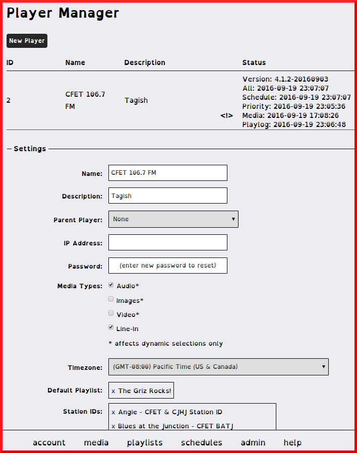
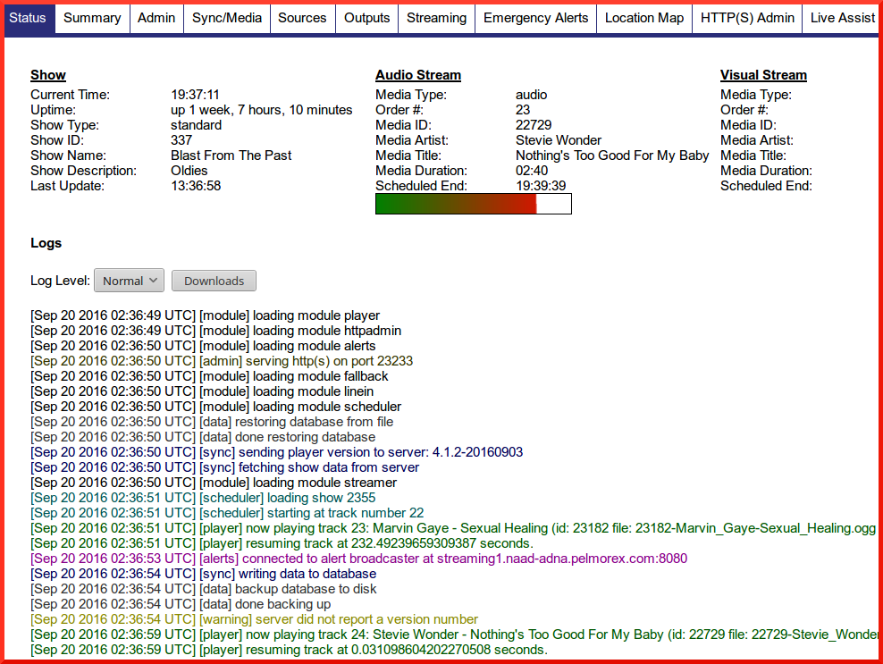

* TOC
{:toc}

# Quick Start Guide
{:toc}

__Preamble instructions__

This quick start guide will get media playing on a playout box managed by a OBServer.

__Prerequisites__

Updated OBServer and OBPlayer that can see each other on same machine or on network. 

__Note: This documentation only applies to special hardware offerings and not part of the DIY self install instructions__

## Server

### Upload Media

1. On the bottom Navigation Bar is a `Media>New Media`.

1. Select the file you want to upload.

1. Fill in mandatory info for Artist and Title.

1. Save

1. You'll see the media you just added appear in the `Media Sidebar`

### Create Default Playlist

If a Player cannot locate a schedule of media to be played, it will play the Default Playlist (DPL) in a loop to avoid dead air.  Server will sync DPL with remote Player and play the contents of DPL.

Use `Playlist` menu to create a new playlist: 

1. Select `Playlist>New`

1. Provide a `Name` and `Description` for the (DPL).

1. From the media sidebar tab, click hold to __drag and drop__ selections to the DPL. As items are added to the list of Playlist Items, the `Total Duration` for all items on the Playlist is updated. Add items to the Playlist until the desired duration is achieved. See [Server Documentation](/observer/#playlist) for more details on creating Playlists.

1. Status select visible. This allows users to see your show, but not change it. Private makes your show invisible to others. Public shares media through public API (if enabled)

1. Save Data.

### Create The Player

{: .screen shot}

Using the `admin` menu to access the `player manager` options:

1. `Expand` existing Player Settings for a defined __Player__, or create a `New Player`.

1. Provide a `Name` and `Description` for the __Player__.

1. Enter the password that will be required for the __Player__ to establish a sync connection to the __Server__.

1. Leave IP blank.

1. Set the media types that will be available for the __Player__. Ensure the __Player__ is configured properly to handle the 
assigned media types.

1. Set the `Timezone` that will be used for scheduling shows.

1. Drag the __Playlist__ created in the previous step (DPL) from the Playlist sidebar tab to the __Default Playlist__ drop zone (the area highlighted during the drag operation).

1. Save the Player.

When newly player is created, it will be assigned a unique `Device-ID` and show up in `Schedule`
{: .alert .alert-info}

## Player

### Provision The Player

Access the [Player Dashboard](#dash) and go to the `Sync Media`  

`Device ID`generated in `Player Manager`

`Password` with the password you enter in server

`Sync URL`  

~~~~ 
https://<IP_of_Server>/remote.php 
~~~~

For initial testing set `Media Sync Mode` to `Remote`

'Enable The Scheduler' so the player tries to check managing server

<SCREEN SHOT> Enable Scheduler

### Sync the Player to Server

{: .screen shot}

Restart player with `Admin>Delete DB and restart` Forces schedule and media sync refresh and take you back to main `Status` page.

Observe sync connection messages. If no Red Errors then player is provisioned and is now run from server.  You will see media being downloaded.

Once media is finished downloading, it will begin playing. 

You will be able to hear audio coming out of Pulse Audio (used as default)

## Advanced

### Search Media

Your media is now in the database and can be searched

All searches are based on the parameters you include when you upload your tracks. Please be accurate as possible entering Metadata when uploading tracks.

Under the media tab you will find

- `Simple` Quick search. Start typing and search results will appear.

- `Advanced` Apply filters for: Artist, Title, Genre, Comments, Duration (in seconds). 

Check out the drop down menus for all the options. 

Click the Add button to apply the filter. 

To get out of Advanced search click the Simple link.

_Too many filters may not give you a result_

### Schedule a Show

Once the Player is provisioned and playing the DPL, go into Server and schedule a `Playlist` and `Media`

1. Open `Schedule` on the bottom navigation bar on server

1. Locate `Playlist` from sidebar and drag it into the schedule.

1. Select the date and times they are assigned and the show is set into the schedule.

1. Save

Media items and schedule information will automatically sync from server to player.

Intitial `show lock-in time` will require at least 20 minutes of lead time before playout of a scheduled or default playlist, thus ensuring all required media are downloaded before a show begins.
{: .alert .alert-info}

For more details, go to [Trouble Shooting](/troubleshooting)

